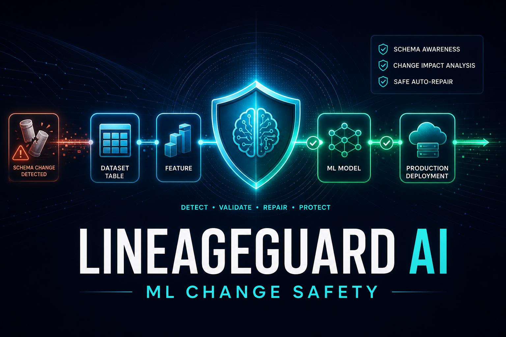
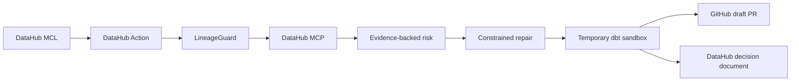
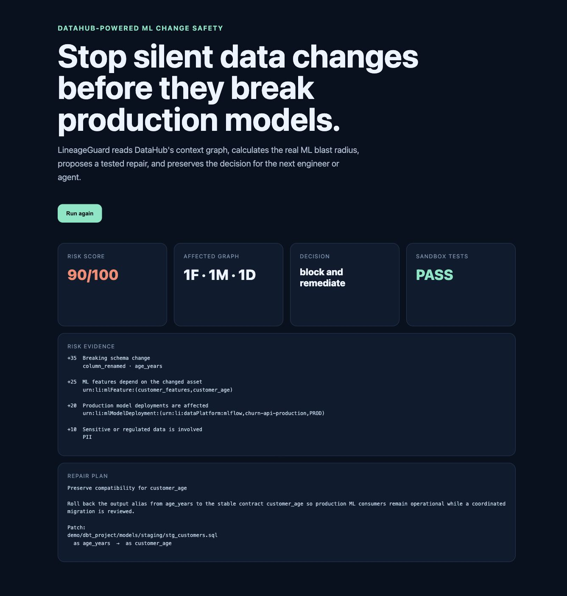

# LineageGuard AI

**Stop silent data changes before they break production models.**



LineageGuard AI is an event-driven ML change-safety agent built for the **Production
ML Agents** track of the Build with DataHub Agent Hackathon. It uses DataHub as the
authoritative context graph, calculates an explainable ML blast radius, proposes a
minimal repair, proves that repair in an isolated dbt sandbox, and writes the decision
back for the next engineer or agent.

## The complete loop

1. A DataHub Action detects a `schemaMetadata` change log event.
2. LineageGuard normalizes it into a small, versioned `ChangeEvent` contract.
3. The official DataHub MCP server supplies schemas, ownership, tags, and three-hop
   lineage across datasets and ML entities.
4. A deterministic policy scores the change and exposes every evidence point.
5. A constrained planner proposes the smallest compatibility repair.
6. The patch is applied only in a temporary copy and must pass the real `dbt build`.
7. Optional write paths create a GitHub **draft** PR and a related DataHub decision
   document. They are disabled by default.



## Verified result

The included failure renames `customer_age` to `age_years` without compatibility.

| Evidence | Real DataHub result |
|---|---|
| Source | dbt `lineageguard.main.stg_customers` |
| Governance | PII, Tier1, technical owner |
| ML blast radius | 1 MLFeature, 1 MLModel, 1 production deployment |
| Decision | 90/100, critical, block and remediate |
| Repair | restore the stable `customer_age` output contract |
| Proof | all 9 dbt build/test steps pass in a temporary sandbox |
| Writeback | `urn:li:document:lineageguard-datahub-31e4e1b6a72c9344` |
| Packaged app | locked Docker build, `/health` OK, full validation API and UI verified |

The zero-credential fixture deliberately includes a high-usage signal and scores
100/100. The real OSS DataHub path scores 90/100 because this local catalog does not
provide production usage percentiles.



The repository also includes captured proof from the verified local run: the
[DataHub asset context](assets/datahub-asset.jpg), [ML lineage](assets/datahub-lineage.jpg),
and [decision-document writeback](assets/datahub-decision.jpg). A concise
[2:19 narrated demo](assets/lineageguard-demo.mp4) walks through the same verified
workflow.

## Safety properties

- Read-only MCP tools; mutation tools are not enabled.
- DataHub writeback and GitHub publication default to `false`.
- Exact one-match patches only; path traversal and ambiguous edits are rejected.
- Validation occurs in an OS temporary directory with a command timeout.
- GitHub output is always a draft PR; no merge or deployment path exists.
- Docker and DataHub CLI state is isolated under `.runtime`.

See [docs/SECURITY.md](docs/SECURITY.md) for the full boundary.

## Quick start without DataHub

Requirements: Python 3.11 and [uv](https://docs.astral.sh/uv/).

```bash
make setup
make lint
make test
make demo-build
make eval
make api
```

Open <http://localhost:8000> and click **Analyze and validate**. This path uses the
deterministic context fixture but executes the real temporary dbt sandbox.

The same zero-credential demo is available as a reproducible container. The image
uses `uv.lock`, so Docker and local development resolve the same dependency set.

```bash
docker build -t lineageguard-ai:local .
docker run --rm -p 8000:8000 lineageguard-ai:local
```

Then open <http://localhost:8000>, or check `curl http://localhost:8000/health`.

## Full DataHub, MCP, and Actions demo

Requirements: Docker Desktop in addition to the quick-start requirements.

```bash
make datahub-up
make demo-build
make demo-docs
LINEAGEGUARD_DATAHUB_GMS_URL=http://localhost:8080 make demo-ingest
LINEAGEGUARD_DATAHUB_GMS_URL=http://localhost:8080 make datahub-seed
```

DataHub is available at <http://localhost:9002> with the Quickstart credentials
`datahub` / `datahub`.

Run the API against the official local MCP server:

```bash
LINEAGEGUARD_CONTEXT_MODE=mcp \
LINEAGEGUARD_DATAHUB_GMS_URL=http://localhost:8080 \
LINEAGEGUARD_DATAHUB_MCP_URL=stdio://mcp-server-datahub \
LINEAGEGUARD_ENABLE_DATAHUB_WRITEBACK=true \
make api
```

In another terminal, start the real-time action:

```bash
make actions
```

The action consumes only dataset `schemaMetadata` MCL events. Its Kafka consumer uses
the Quickstart broker and GMS schema-registry endpoint.

## Optional GitHub draft PR

Set a fine-grained token with access only to the intended repository:

```bash
LINEAGEGUARD_ENABLE_GITHUB_PR=true
LINEAGEGUARD_GITHUB_TOKEN=...
LINEAGEGUARD_GITHUB_REPOSITORY=owner/repository
```

The publisher creates a new branch, updates only the validated file paths, and opens a
draft PR through the GitHub REST API. It does not touch the local checkout or merge.

## Main commands

| Command | Purpose |
|---|---|
| `make validate` | reproduce and validate the repair in a temporary copy |
| `make eval` | run the five-case deterministic risk evaluation |
| `make datahub-up` | start isolated DataHub 1.6.0 Quickstart |
| `make datahub-seed` | write the ML and governance graph |
| `make actions` | start the schema-change event consumer |
| `make datahub-down` | stop the project Quickstart without deleting its data |

## Repository map

- `src/lineageguard/` — API, workflow, MCP context, risk, repair, safety, Actions,
  DataHub writeback, and GitHub publisher.
- `demo/dbt_project/` — healthy dbt-duckdb feature pipeline.
- `demo/faults/` — reproducible schema failure and healthy reset.
- `infra/` — dbt ingestion and DataHub Actions recipes.
- `evals/` — scenario dataset and executable evaluation.
- `skills/ml-change-safety/` — reusable DataHub agent workflow.
- `docs/` — architecture, safety model, demo script, submission copy, and verified
  Devpost evidence ledger.

The final public submission is available at
[devpost.com/software/lineageguard-ai](https://devpost.com/software/lineageguard-ai),
with its durable status and public-link audit recorded in
[`docs/SUBMISSION_EVIDENCE.md`](docs/SUBMISSION_EVIDENCE.md).

## Open-source provenance

The architecture reuses official Apache-2.0 DataHub components: the Python SDK,
Actions, official MCP server, and patterns from Analytics Agent and DataHub Skills. The
SSPL dbt Impact Action was reviewed only to understand the existing product boundary;
no source was copied. Details are in [NOTICE](NOTICE).

## License

Apache-2.0.
