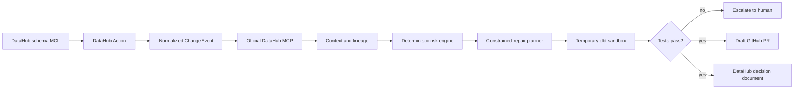

# Architecture

LineageGuard AI is intentionally split into an authoritative context plane and a
constrained execution plane.

## Why this design

- **DataHub is the context authority.** MCP provides datasets, schemas, owners, tags,
  and multi-hop lineage. The SDK is used only to enrich ML deployment details that the
  current OSS MCP response does not expose.
- **Scoring is deterministic and inspectable.** Every point maps to evidence. An LLM
  cannot silently change the blocking threshold.
- **Code execution is allowlisted.** A proposed edit must contain one exact text match,
  remain inside a temporary project copy, and pass `dbt build` under a timeout.
- **Publication stays reviewable.** GitHub output is always a draft PR. No automatic
  merge, production deployment, or destructive DataHub mutation is implemented.
- **Decisions become reusable context.** A successful analysis is stored as a DataHub
  document related to the changed asset.

## Data model used in the demo

`stg_customers.customer_age` feeds the `customer_age` MLFeature, which feeds
`churn-model-v3`, which is served by `churn-api-production`. The source and all ML
entities carry a technical owner and Tier1 governance; the source also carries PII.

## Failure boundaries

- DataHub or MCP unavailable: fail closed; no risk decision or PR is produced.
- Ambiguous patch: reject before writing.
- Test timeout or failure: retain the evidence and require human review.
- Missing GitHub credentials: return the validated plan without attempting publication.
- Writeback failure: surface an API error rather than claiming the report was stored.
